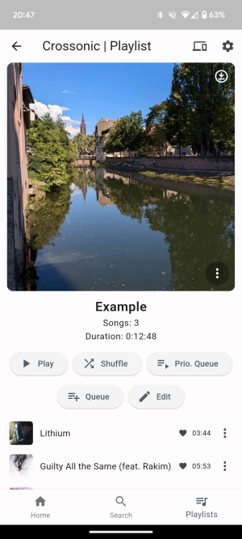

# Crossonic

A cross platform music client for [crossonic-server](https://github.com/juho05/crossonic-server).

## Status

This app is still in development. Some features are missing and bugs are to be expected.

Not all [platforms](#supported_platforms) are properly supported yet.

## Features

- [x] Desktop and mobile layout
- [x] Respects light/dark theme and accent color
- [x] System integration (*Android media API*, *MPRIS*, *SystemMediaTransportControls*, …)
- [x] Stream original or transcoded media
  - [x] configurable transcoding settings for WiFi and mobile
- [x] Browse/search songs, albums, artists
- [x] Playlists
  - [x] download for offline listening (*except web*)
- [x] [ListenBrainz](https://listenbrainz.org) integration
  - [x] scrobble
  - [x] sync favorite songs
- [x] Two queue system
  - normal queue
    - automatically populated when listening to an album/artist/playlist
  - priority queue
    - for songs you want to listen now before continuing with the normal queue
  - both can be freely modified
- [x] Shuffle artists by song or by album
- [x] Gapless playback (*Linux, Android*)
- [x] Lyrics
  - [x] unsynced
  - [ ] synced
- [ ] Remote control other devices running the app
- [ ] Cast to [SONOS](https://www.sonos.com) (implemented, but *very* buggy)
- [ ] Browse favorites
- [ ] Save queues

## Supported platforms

While this app can be built for every platform [Flutter](https://flutter.dev) supports (although some additional configuration might be necessary), playback can be very buggy on some platforms and might not support all features.

**reliable**
- Linux (*gapless*)
- Windows

**semi-reliable**
- Android (*gapless*)
  - playback sometimes restarting when streaming transcoded media that's not cached on the server
- Web (*no playlist download*)
  - Safari playback randomly stops when streaming transcoded media

**unsupported**
- macOS
- iOS

## Build/run

Install [Flutter](https://docs.flutter.dev/get-started/install) with all dependencies for your desired target platform.

Clone the repository
```bash
git clone https://github.com/juho05/crossonic
cd crossonic
```

### Linux

#### Install dependencies

Install [GStreamer](https://gstreamer.freedesktop.org/documentation/installing/on-linux.html?gi-language=c).

##### Debian

```bash
sudo apt-get install libgstreamer1.0-dev libgstreamer-plugins-base1.0-dev gstreamer1.0-plugins-good
```

##### ArchLinux

```bash
sudo pacman -S gstreamer gst-libav gst-plugins-base gst-plugins-good
```

#### Build

In the directory of the repository run:

```bash
flutter build linux --release
```

The built executable is at `./build/linux/x64/release/bundle/Crossonic`.

### Windows

No extra dependencies should be required.

In the directory of the repository run:
```bash
flutter build windows --release
```

### Web

No extra dependencies should be required.

In the directory of the repository run:
```bash
flutter build web --release
```

Now you can serve `./build/web` with a web server like [Caddy](https://caddyserver.com/).

## Screenshots



