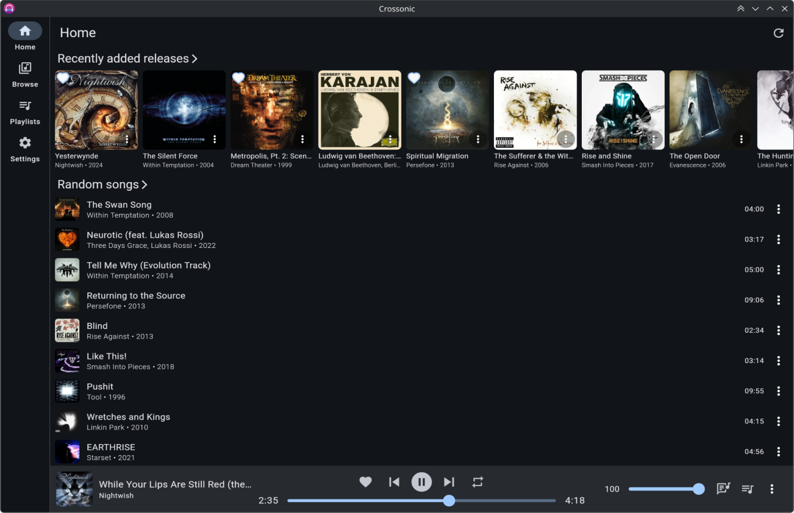
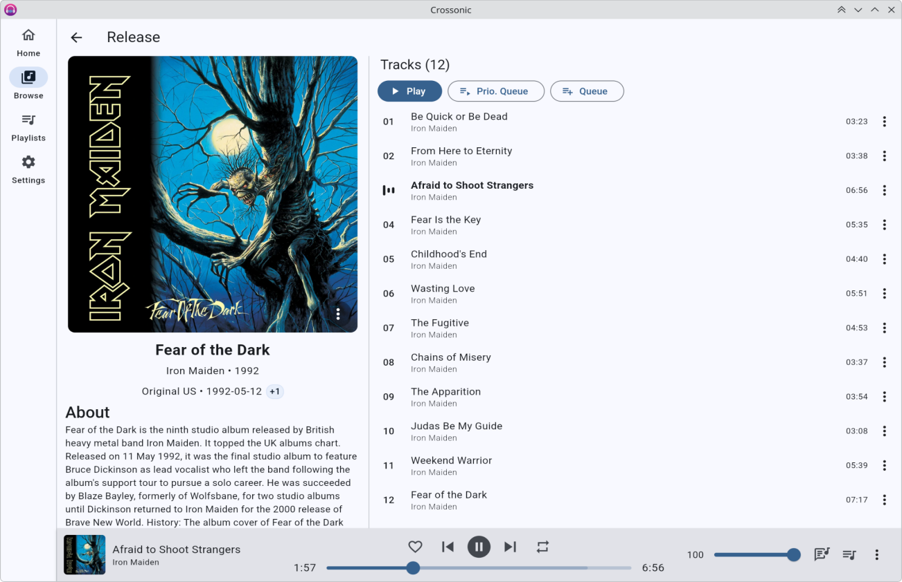
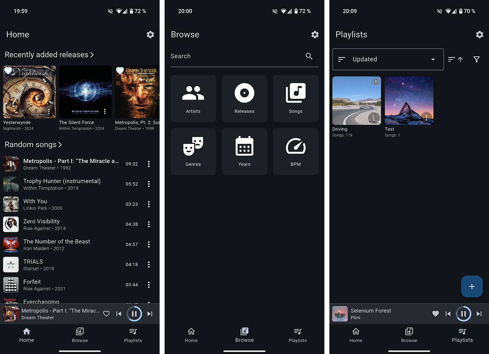
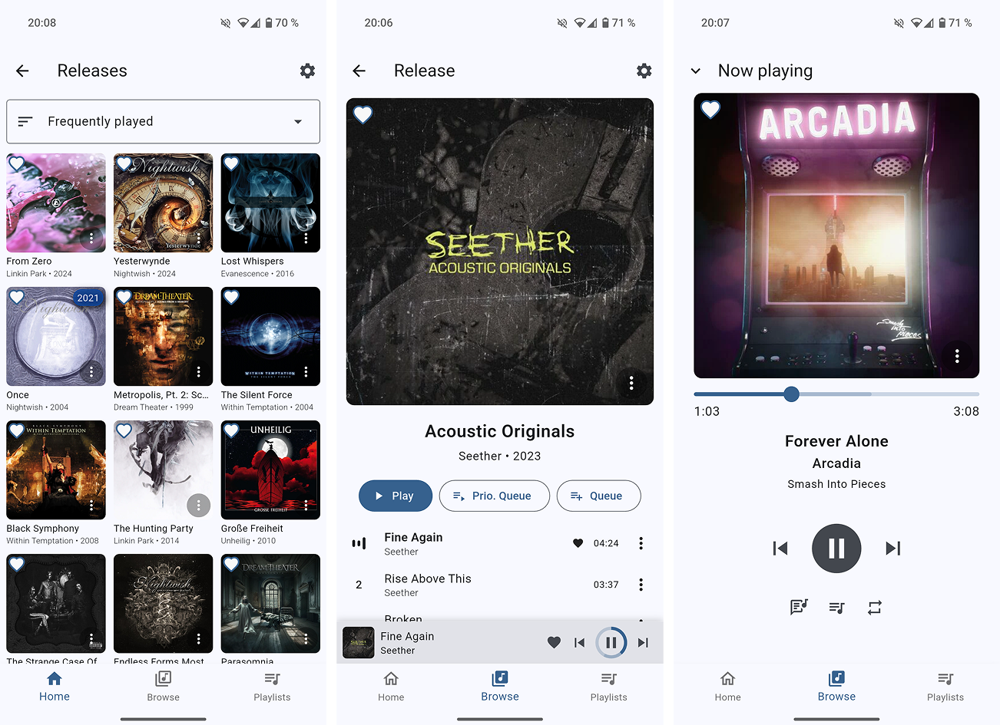
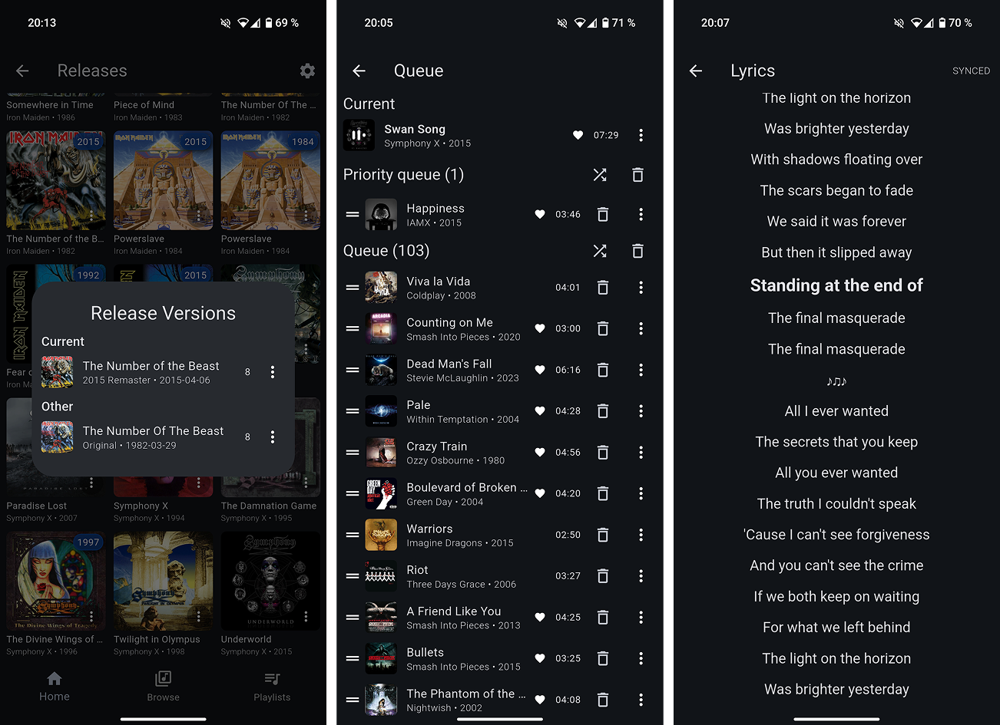

# Crossonic

A cross-platform music client for [crossonic-server](https://github.com/juho05/crossonic-server) and other [(Open)Subsonic](https://opensubsonic.netlify.app/) compatible music servers.

[Screenshots](https://crossonic.org/app#screenshots)

[Install](https://crossonic.org/app/install)

## Status

This app is still in development. Some features are missing and bugs are to be expected.

Please [report](https://github.com/juho05/crossonic/issues/new/choose) any issues or feature requests.

This app should be compatible with all _Subsonic_ compatible servers, but I recommend to only use servers implementing
the [OpenSubsonic]() standard. For the best experience (and full feature support) I recommend using [crossonic-server](https://github.com/juho05/crossonic-server).

**Release builds exist for these platforms:**
- Windows (`.exe` installer)
- macOS (`.dmg`)
- Linux (`.AppImage`, `.tar.gz`)
- Android (`.apk`)
- Web (`.zip` of static files), *with some caveats:*
  - some features are disabled
  - poor performance on some platforms/browsers
  - limited support for transcoded playback (depends on browser)
  - no gapless playback
  - sub-optimal image caching

The app works on iOS but there are currently no release builds available as I don't have an Apple Developer account.

## Features

- [x] Desktop and mobile layout
- [x] Configurable home page
- [x] Respects light/dark theme and accent color
- [x] System integration (*Android media API*, *MPRIS*, *SystemMediaTransportControls*, …)
- [x] Android Auto
    - Currently only playlists
- [x] Close to tray
- [x] Stream original or transcoded media
    - [x] Configurable transcoding settings for WiFi and mobile
- [x] Browse/search songs, albums, artists
- [x] Release types (albums, EPs, singles, live, compilations, …)
- [x] Release versions (*Deluxe*, *Remaster*, *different release years*, *etc.*)
- [x] Favorite songs/albums/artists
- [x] Playlists
    - [x] Download for offline listening
        - [x] Original (*uses [download](https://opensubsonic.netlify.app/docs/endpoints/download/) endpoint*)
        - [ ] Transcoded
    - [x] Add songs/albums/artists
    - [x] Drag&drop reorder
    - [x] Change cover (*crossonic-server only*)
- [x] Configure [ListenBrainz](https://listenbrainz.org) connection (*crossonic-server only*)
- [x] Full [OpenSubsonic](https://opensubsonic.netlify.app/) support (*gracefully handles missing features on the server*)
    - API Key Authentication
    - Transcoded seek
    - Multiple artists/genres/…
    - etc.
- [x] Two queue system
    - Normal queue
        - Automatically populated when listening to an album/artist/playlist
    - Priority queue
        - For songs you want to listen now before continuing with the normal queue
    - Both can be freely modified
- [x] Shuffle artists by song or by album
- [x] Gapless playback
- [x] Lyrics
    - [x] Unsynced
    - [x] Synced
- [x] Replay gain
- [ ] Load/save queues
- [ ] Internet Radio
- [ ] Pre-cache next x songs for spotty networks
- [ ] Jukebox
- [ ] Remote control other devices running the app
- [ ] End-of-year recap

### Out-of-scope

The OpenSubsonic API supports some features that are out-of-scope for this application:

- Video support
- Podcasts
- Chat

## Installation

Installation instructions are available on the [Crossonic website](https://crossonic.org/app/install).

## Build

Install [Flutter](https://docs.flutter.dev/get-started/install) with all dependencies for your desired target platform.

Clone the repository
```bash
git clone https://github.com/juho05/crossonic
cd crossonic
```

Run code generation:
```bash
dart run build_runner build
```

### Linux

#### Install dependencies

- Install `libmpv`
- Install `ayatana-appindicator3-0.1` or `appindicator3-0.1`

##### Debian

```bash
sudo apt install mpv libmpv-dev libayatana-appindicator3-dev
```

##### ArchLinux

```bash
sudo pacman -S mpv libayatana-appindicator
```

#### Build

In the directory of the repository run:

```bash
flutter build linux
```

### Windows

In the directory of the repository run:

```bash
flutter build windows
```

### macOS

In the directory of the repository run:
```bash
flutter build macos
```

### Android

In the directory of the repository run:
```bash
flutter build apk
```

### iOS

- Select your development team in Xcode
  - Open `./ios/Runner.xcworkspace` in Xcode
  - Select `Runner` in the project navigator
  - Select your team in the `Team` dropdown on the `Signing & Capabilities` tab (you'll need to create your team first if you do not already have a team)

In the directory of the repository run:
```bash
flutter build ios
```

### Web

In the directory of the repository run:
```bash
flutter build web --wasm
```

Now you can serve `./build/web` with a web server like [Caddy](https://caddyserver.com/).

#### Hosting requirements

- Use TLS (`https`) if not on `localhost`
- Ensure that `/sqlite3.wasm` is served with `Content-Type: application/wasm`
- Set `Cross-Origin-Opener-Policy` to `same-origin`
- Set `Cross-Origin-Embedder-Policy` to `require-corp` or `credentialless`

## Screenshots







## License

Copyright (c) 2024-2025 Julian Hofmann

This program is free software: you can redistribute it and/or modify
it under the terms of the GNU Affero General Public License as published
by the Free Software Foundation, either version 3 of the License, or
(at your option) any later version.

This program is distributed in the hope that it will be useful,
but WITHOUT ANY WARRANTY; without even the implied warranty of
MERCHANTABILITY or FITNESS FOR A PARTICULAR PURPOSE.  See the
GNU Affero General Public License for more details.

You should have received a copy of the GNU Affero General Public License
along with this program.  If not, see <https://www.gnu.org/licenses/>.
