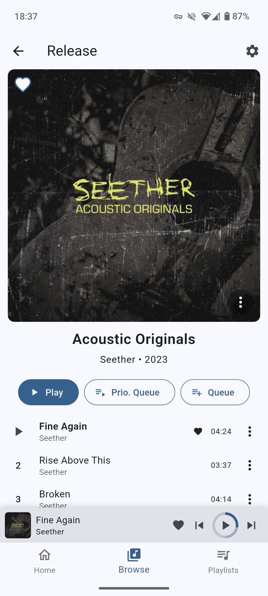

# Crossonic

A cross platform music client for [crossonic-server](https://github.com/juho05/crossonic-server) and other [(Open)Subsonic](https://opensubsonic.netlify.app/) compatible music servers.

[Screenshots](#screenshots)

[Install](#installation)

## Status

This app is still in development. Some features are missing and bugs are to be expected.

The app should support all _Subsonic_ compatible servers ([Navidrome](https://www.navidrome.org/), [gonic](https://github.com/sentriz/gonic), [lms](https://github.com/epoupon/lms), [airsonic-advanced](https://github.com/airsonic-advanced/airsonic-advanced), ...),
but I only regularly test with [crossonic-server](https://github.com/juho05/crossonic-server). Please [report](https://github.com/juho05/crossonic/issues/new) any
issues you experience with other servers.

There are pre-release artifacts available on the [releases](https://github.com/juho05/crossonic/releases) page
but there is currently no auto-update mechanism and the [installation process](#installation) is sub-optimal on many platforms.

See [supported platforms](#supported-platforms) for a status per platform.

## Features

- [x] Desktop and mobile layout
- [x] Configurable home page
- [x] Respects light/dark theme and accent color
- [x] System integration (*Android media API*, *MPRIS*, *SystemMediaTransportControls*, …)
- [x] Android Auto
  - currently only playlists
- [x] Close to tray
- [x] Stream original or transcoded media
  - [x] configurable transcoding settings for WiFi and mobile
- [x] Browse/search songs, albums, artists
- [x] Release types (albums, EPs, singles, live, compilations, …)
- [x] Favorite songs/albums/artists
- [x] Playlists
  - [x] download for offline listening
    - [x] original (*uses [download](https://opensubsonic.netlify.app/docs/endpoints/download/) endpoint*)
    - [ ] transcoded
  - [x] Add songs/albums/artists
  - [x] drag&drop reorder
  - [x] change cover (*crossonic-server only*)
- [x] Configure [ListenBrainz](https://listenbrainz.org) connection (*crossonic-server only*)
- [x] Full [OpenSubsonic](https://opensubsonic.netlify.app/) support (*gracefully handles missing features on the server*)
  - API Key Authentication
  - Transcoded seek
  - Multiple artists/genres/…
  - etc.
- [x] Two queue system
  - normal queue
    - automatically populated when listening to an album/artist/playlist
  - priority queue
    - for songs you want to listen now before continuing with the normal queue
  - both can be freely modified
- [x] Shuffle artists by song or by album
- [x] Gapless playback
- [x] Lyrics
  - [x] unsynced
  - [ ] synced
- [x] Replay gain
- [ ] Load/save queues
- [ ] Internet Radio
- [ ] Pre-cache next x songs for spotty networks
- [ ] Jukebox
- [ ] Remote control other devices running the app
- [ ] End-of-year recap

### Out-of-scope

The OpenSubsonic API supports some features that are out-of-scope for this application:

- Video support
- Podcasts
- Chat

## Supported platforms

**regularly tested**
- Linux
- Android

**infrequently tested**
- macOS
- Windows

**not tested but should work**
- iOS

**some limitations**
- Web
  - no gapless playback (not supported by web APIs)
  - Safari playback randomly stops when streaming transcoded media
  - slow image loading
  - (significantly) worse performance than native

## Installation

*To update an existing installation just repeat the installation instructions again for the new version.*

**Make sure that you fully exit Crossonic before trying to install a new version**.

### Android

Download and execute the *APK* file for your architecture from the [releases](https://github.com/juho05/crossonic/releases/latest) page.

**Android Auto:** By default Android Auto does not show apps that were not installed from the Google Play Store.
To enable side-loaded apps open the *Android Auto* settings on your phone (you might have to click on *Additional settings in the app* first), then scroll down to *Version* and click on it a couple of times to enable *Developer Mode*. Now, use the three-dot menu in the top-right corner to enter *Developer Settings* and enable *Unknown Sources*.

### Linux

- Download `Crossonic-x.x.x-linux-x86-64.AppImage` from the [releases](https://github.com/juho05/crossonic/releases/latest) page
- Execute the *AppImage* file (you might have to make it executable first)
- When asked whether to integrate the AppImage into your system, hit *Yes*

### Windows

Download and execute `Crossonic-x.x.x-windows-x86-64.exe` from the [releases](https://github.com/juho05/crossonic/releases/latest) page.

### macOS

- Download and execute `Crossonic-x.x.x-macOS-universal.dmg`
- Drag `Crossonic.app` to the `Applications` directory

**NOTE:** Currently macOS binaries are not signed. If macOS prevents you from opening the `.dmg` file or starting the app, you will need to
open *System Settings*, click on *Privacy & Security*, scroll down to *Security* where it says that Crossonic was blocked and hit *Open Anyway*.
This should only be necessary once after a new version was installed.

### Web

- Download and extract `Crossonic-x.x.x-web.zip` from the [releases](https://github.com/juho05/crossonic/releases/latest) page
- Host the extracted files with a web server like [Caddy](https://caddyserver.com/)

#### Hosting requirements

- Use TLS (`https`) if not on `localhost`
- Ensure that `/sqlite3.wasm` is served with `Content-Type: application/wasm`
- Set `Cross-Origin-Opener-Policy` to `same-origin`
- Set `Cross-Origin-Embedder-Policy` to `require-corp` or `credentialless`

### iOS

There are currently no release builds available for iOS.

See [Build](#build) for how to build Crossonic yourself.

## Build

Install [Flutter](https://docs.flutter.dev/get-started/install) with all dependencies for your desired target platform (including those required for)

Clone the repository
```bash
git clone https://github.com/juho05/crossonic
cd crossonic
```

Run code generation:
```bash
dart run build_runner build # or watch to automatically run build on file changes
```

### Linux

#### Install dependencies

- Install `libmpv`
- Install `libsecret-1-0` and `libjsoncpp1`
- Install `ayatana-appindicator3-0.1` or `appindicator3-0.1`

##### Debian

```bash
sudo apt install mpv libmpv-dev libsecret-1-dev libjsoncpp-dev libayatana-appindicator3-dev
```

##### ArchLinux

```bash
sudo pacman -S mpv libsecret jsoncpp libayatana-appindicator
```

#### Build

In the directory of the repository run:

```bash
flutter build linux
```

### Windows

In the directory of the repository run:

```bash
flutter build windows
```

### macOS

In the directory of the repository run:
```bash
flutter build macos
```

### Android

No additional dependencies should be required.

```bash
flutter build apk
```

### iOS

- Select your development team in Xcode
  - Open `./ios/Runner.xcworkspace` in Xcode
  - Select `Runner` in the project navigator
  - Select your team in the `Team` dropdown on the `Signing & Capabilities` tab (you'll need to create your team first if you do not already have a team)

In the directory of the repository run:
```bash
flutter build ios
```

### Web

No additional dependencies should be required.

In the directory of the repository run:
```bash
flutter build web --wasm
```

Now you can serve `./build/web` with a web server like [Caddy](https://caddyserver.com/).

#### Hosting requirements

- Use TLS (`https`) if not on `localhost`
- Ensure that `/sqlite3.wasm` is served with `Content-Type: application/wasm`
- Set `Cross-Origin-Opener-Policy` to `same-origin`
- Set `Cross-Origin-Embedder-Policy` to `require-corp` or `credentialless`

## Screenshots

### Desktop

<p align="center">
  
  
</p>

### Mobile

<p align="center">
  
  
  
  
  
  
  
  
  
</p>

## License

Copyright (c) 2024-2025 Julian Hofmann

This program is free software: you can redistribute it and/or modify
it under the terms of the GNU Affero General Public License as published
by the Free Software Foundation, either version 3 of the License, or
(at your option) any later version.

This program is distributed in the hope that it will be useful,
but WITHOUT ANY WARRANTY; without even the implied warranty of
MERCHANTABILITY or FITNESS FOR A PARTICULAR PURPOSE.  See the
GNU Affero General Public License for more details.

You should have received a copy of the GNU Affero General Public License
along with this program.  If not, see <https://www.gnu.org/licenses/>.
