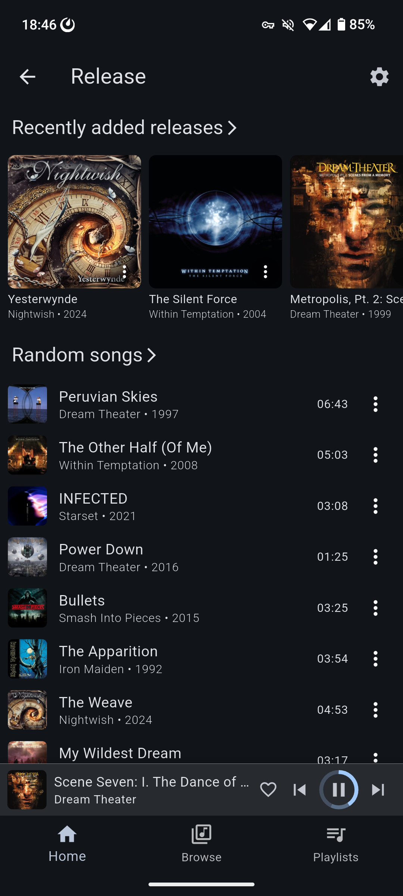

# Crossonic

A cross platform music client for [crossonic-server](https://github.com/juho05/crossonic-server) and other [(Open)Subsonic](https://opensubsonic.netlify.app/) compatible music servers.

[Screenshots](#screenshots)

## Status

This app is still in development. Some features are missing and bugs are to be expected.

See [Supported platforms](#supported-platforms) for a status per platform.

## Features

- [x] Desktop and mobile layout
- [x] Respects light/dark theme and accent color
- [x] System integration (*Android media API*, *MPRIS*, *SystemMediaTransportControls*, …)
- [x] Stream original or transcoded media
  - [x] configurable transcoding settings for WiFi and mobile
- [x] Browse/search songs, albums, artists
- [x] Favorite songs/albums/artists
- [x] Playlists
  - [x] download for offline listening
    - [x] original (*uses [download](https://opensubsonic.netlify.app/docs/endpoints/download/) endpoint*)
    - [ ] transcoded
  - [x] Add songs/albums/artists
  - [x] drag&drop reorder
  - [x] change cover (*crossonic-server only*)
- [x] Configure [ListenBrainz](https://listenbrainz.org) connection (*crossonic-server only*)
- [x] Full [OpenSubsonic](https://opensubsonic.netlify.app/) support (*gracefully handles missing features on server*)
  - API Key Authentication
  - Transcoded seek
  - Multiple artists/genres/…
  - etc.
- [x] Two queue system
  - normal queue
    - automatically populated when listening to an album/artist/playlist
  - priority queue
    - for songs you want to listen now before continuing with the normal queue
  - both can be freely modified
- [x] Shuffle artists by song or by album
- [x] Gapless playback
- [x] Lyrics
  - [x] unsynced
  - [ ] synced
- [x] Replay gain
- [ ] Jukebox
- [ ] Save queues
- [ ] Remote control other devices running the app
- [ ] Internet Radio
- [ ] Pre-cache next x songs for spotty networks

### Out-of-scope

The OpenSubsonic API supports some features that are out-of-scope for this application:

- Video support
- Podcasts
- Chat

## Supported platforms

**fully supported**
- Linux
- Android
- macOS
- Windows

**some limitations**
- Web
  - no gapless playback (not supported by web APIs)
  - Safari playback randomly stops when streaming transcoded media
  - no image caching
  - worse performance than native

**unsupported**
- iOS (*theoretically possible, requires build configuration (permissions, gstreamer, …)*)

## Build/run

Install [Flutter](https://docs.flutter.dev/get-started/install) with all dependencies for your desired target platform.

Clone the repository
```bash
git clone https://github.com/juho05/crossonic
cd crossonic
```

Run code generation:
```bash
dart run build_runner build # or watch to automatically run build on file changes
```

### Linux

#### Install dependencies

- Install [GStreamer](https://gstreamer.freedesktop.org/documentation/installing/on-linux.html?gi-language=c).
- Install libsecret-1-0 and libjsoncpp1

##### Debian

```bash
sudo apt install libgstreamer1.0-dev libgstreamer-plugins-base1.0-dev gstreamer1.0-plugins-good gstreamer1.0-plugins-bad libsecret-1-dev libjsoncpp-dev
```

##### ArchLinux

```bash
sudo pacman -S gstreamer gst-libav gst-plugins-base gst-plugins-goodgstreamer1.0-plugins-bad libsecret jsoncpp
```

#### Build

In the directory of the repository run:

```bash
flutter build linux --release
```

The built executable is at `./build/linux/x64/release/bundle/Crossonic`.

### Windows

#### Install dependencies

Install [GStreamer](https://gstreamer.freedesktop.org/documentation/installing/on-windows.html?gi-language=c) for example with [chocolatey](https://chocolatey.org/):

```bash
choco install gstreamer gstreamer-devel
```

#### Build

In the directory of the repository run:

```bash
flutter build windows --release
```

*NOTE:* The first time starting playback the program might hang for a few seconds and a command prompt window might pop up.
This is a one-time event. Just wait until the playback starts.

### macOS

- Install [GStreamer](https://gstreamer.freedesktop.org/download/#macos) (*runtime* **and** *development*)

In the directory of the repository run:
```bash
flutter build macos --release
```

### Android

- [Download](https://gstreamer.freedesktop.org/download/#android) GStreamer for Android
- Extract the file and rename the resulting directory to `gst-android`
- Move `gst-android` into `./native_bindings/gstreamer/gstreamer_ffi/third-party`
- Ensure that the correct Android NDK version required by your [downloaded GStreamer version](https://gstreamer.freedesktop.org/download/#android) is installed

In the directory of the repository run:
```bash
flutter build apk --release
```

### Web

No additional dependencies should be required.

In the directory of the repository run:
```bash
flutter build web --release
```

Now you can serve `./build/web` with a web server like [Caddy](https://caddyserver.com/).

#### Hosting requirements

- Use TLS (`https`) if not on `localhost`
- Ensure that `/sqlite3.wasm` is served with `Content-Type: application/wasm`
- Set `Cross-Origin-Opener-Policy` to `same-origin`
- Set `Cross-Origin-Embedder-Policy` to `require-corp` or `credentialless`

## Screenshots

### Desktop

<p align="center">
  
  
</p>

### Mobile

<p align="center">
  
  
  
  
  
  
  
</p>

## License

Copyright (c) 2024-2025 Julian Hofmann

This program is free software: you can redistribute it and/or modify
it under the terms of the GNU Affero General Public License as published
by the Free Software Foundation, either version 3 of the License, or
(at your option) any later version.

This program is distributed in the hope that it will be useful,
but WITHOUT ANY WARRANTY; without even the implied warranty of
MERCHANTABILITY or FITNESS FOR A PARTICULAR PURPOSE.  See the
GNU Affero General Public License for more details.

You should have received a copy of the GNU Affero General Public License
along with this program.  If not, see <https://www.gnu.org/licenses/>.